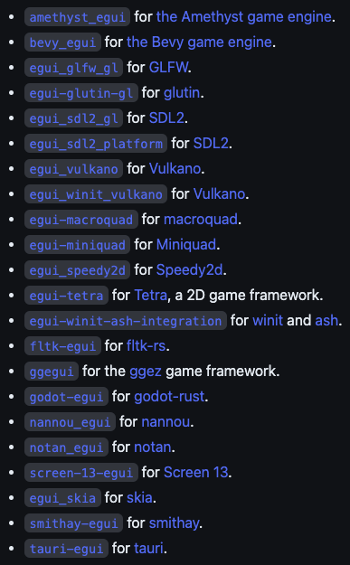
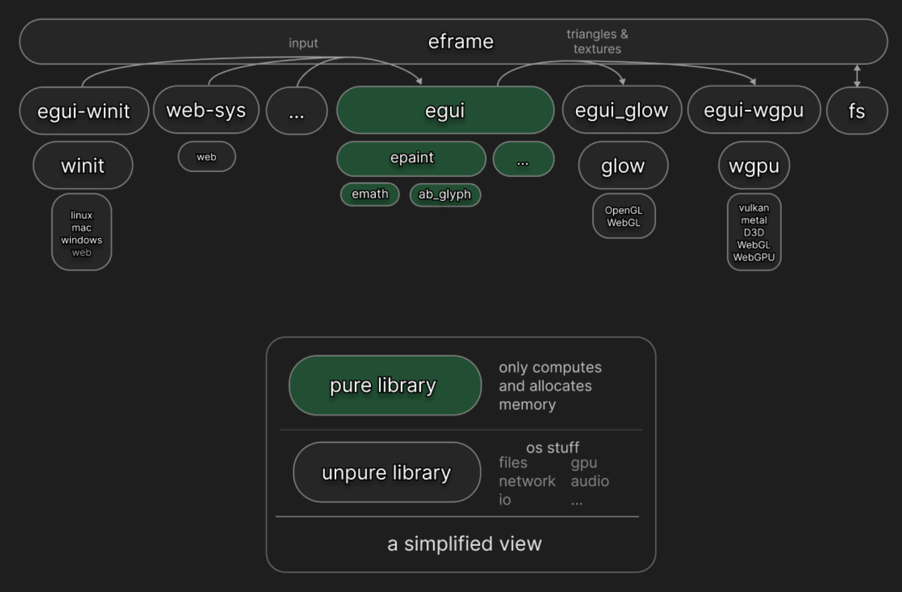

# egui
[www.egui.rs](www.egui.rs)

An easy-to-use immediate mode GUI in Rust that runs on both web and native.

The most popular pure Rust GUI library by downloads on [crates.io](https://crates.io/search?q=gui&sort=downloads) (second only to GTK).

Limited accessibility support via [accesskit](https://crates.io/crates/accesskit).

-------------------------------------------------------------------------------

# This presentation
* What is it?
* How does it work?
* How is it integrated?

-------------------------------------------------------------------------------

# Integrations
## Official
* `eframe`
* `egui_glow`
* `egui-wgpu`
* `egui-winit`

## 3rd party


-------------------------------------------------------------------------------

# History
Wrote the first piece of code in 2018, but started seriously during 2020 pandemic.

Heavily inspired by [Dear ImGui](https://github.com/ocornut/imgui), my favorite GUI library for C++.

Not my first GUI, but my first immediate mode one and my first in Rust.

-------------------------------------------------------------------------------

# Crates


-------------------------------------------------------------------------------

# Immediate mode
20 year old GUI paradigm from game dev

``` rs
if ui.button("-").clicked() {
    counter -= 1;
}

ui.label(counter.to_string());

if ui.button("+").clicked() {
    counter += 1;
}
```

!!!counter_example

-------------------------------------------------------------------------------

# Context

How to write your own egui integration:
```rs
let mut ctx = egui::Context::default();

// Game loop:
loop {
    // Gather keyboard/mouse events:
    let raw_input = window.collect_input();

    // Run egui:
    let output = ctx.run(raw_input, |ctx| {
        egui::CentralPanel::default().show(&ctx, |ui| {
            ui.label("Hello world!");
            if ui.button("Click me").clicked() {
                // take some action here
            }
        });
    });

    // Set cursor icon, set clipboard, open url, …
    window.handle_platform_output(output.platform_output);

    let triangles = ctx.tessellate(output.shapes);
    window.paint(output.textures_delta, triangles);
}
```

-------------------------------------------------------------------------------

# Input
``` rs
pub struct RawInput {
    pub time: Option<f64>,
    pub events: Vec<Event>,
    pub modifiers: Modifies,
    // …
}

pub enum Event {
    Copy,
    Cut,
    Paste(String),
    Text(String),
    Key { … },
    PointerMoved(Pos2),
    PointerButton { … },
    …
}
```

-------------------------------------------------------------------------------

# Ui
A hierarchial region of the screen with a layout where you can put widgets.

``` rs
fn show_some_text(ui: &mut egui::Ui) {
    ui.label("Some text");
    ui.horizontal(|ui| {
        ui.label("More");
        ui.label("text");
    });
    ui.label("Even more text");
}
```

!!!ui_example

-------------------------------------------------------------------------------

# Scopes

* Different layouts
* Containers widgets (`ScrollArea`, `Window`, …)
* Scopes with different styling
* …

``` rs
// Error prone:
ui.push_horizontal();
    ui.label("More");
    ui.label("text");
ui.pop_horizontal();
```

``` rs
// I wish:
with ui = ui.horizontal() {
    ui.label("More");
    ui.label("text");
}
```

``` rs
// Ugly `Drop` hack? Requires lifetime on `Ui` :/
{
    let ui = ui.horizontal()
    ui.label("More");
    ui.label("text");
}
```

``` rs
// Solution: closuers
ui.horizontal(|ui| {
    ui.label("More");
    ui.label("text");
});
```


-------------------------------------------------------------------------------

# Layout

|           |                                                  |
|-----------|--------------------------------------------------|
| Min Rect  |   Bounding rect of all widgets so far            |
| Max Rect  |   Try to keep within these bounds (wrap width)   |
| Direction |   Down, Up, Left-to-Right, Right-to-Left         |
| Cursor    |   Where to place the next widget                 |

-------------------------------------------------------------------------------

# Response
Returned from by widget. Has a `Rect`, a `Context` and interaction flags.

``` rs
if ui
    .button("Save")
    .on_hover_text("Click to save document")
    .clicked()
{
    save();
}

if ui.add(egui::Slider::new(&mut volume, 0.0..=100.0)).changed() {
    set_volume(volume);
}
```

-------------------------------------------------------------------------------

# Writing a widget

``` rs
fn toggle_widget(ui: &mut Ui, on: &mut bool) -> Response {
    let desired_size = ui.spacing().interact_size.y * vec2(2.0, 1.0);
    let (rect, mut response) = ui.allocate_exact_size(desired_size, Sense::click());
    if response.clicked() {
        *on = !*on;
        response.mark_changed();
    }
    response.widget_info(|| WidgetInfo::selected(WidgetType::Checkbox, *on, ""));

    if ui.is_rect_visible(rect) {
        let how_on = ui.ctx().animate_bool(response.id, *on);
        let visuals = ui.style().interact_selectable(&response, *on);
        let rect = rect.expand(visuals.expansion);
        let radius = 0.5 * rect.height();
        ui.painter()
            .rect(rect, radius, visuals.bg_fill, visuals.bg_stroke);
        let circle_x = lerp((rect.left() + radius)..=(rect.right() - radius), how_on);
        let center = pos2(circle_x, rect.center().y);
        ui.painter()
            .circle(center, 0.75 * radius, visuals.bg_fill, visuals.fg_stroke);
    }

    response
}
```

``` rs
toggle_widget(ui, &mut some_bool);
```

!!!toggle_widget

-------------------------------------------------------------------------------

# Widgets

```rs
ui.add(egui::Label::new("Hello"));

egui::Label::new("Hello").ui(ui);

ui.label("Hello");
```


``` rs
pub trait Widget {
    fn ui(self, ui: &mut Ui) -> Response;
}
```

-------------------------------------------------------------------------------

# Builder pattern

```rs
ui.add(
    Slider::new(&mut volume, 0.0..=120.0)
        .logarithmic(true)
        .suffix("dB")
);
```

``` rs
// I wish :(
ui.slider(&mut volume, 0.0..=120.0, logarithmic=true, suffix="dB");
```

-------------------------------------------------------------------------------

# FullOutput

``` rs
pub struct FullOutput {
    /// Non-rendering related output.
    pub platform_output: PlatformOutput,

    /// If `Duration::is_zero()`, egui is requesting immediate repaint (i.e. on the next frame).
    pub repaint_after: std::time::Duration,

    /// Texture changes since last frame (including the font texture).
    pub textures_delta: epaint::textures::TexturesDelta,

    /// What to paint.
    pub shapes: Vec<epaint::ClippedShape>,
}

```

-------------------------------------------------------------------------------

# PlatformOutput

``` rs
pub struct PlatformOutput {
    /// Set the cursor to this icon.
    pub cursor_icon: CursorIcon,

    /// If set, open this url.
    pub open_url: Option<OpenUrl>,

    /// If set, put this text in the system clipboard. Ignore if empty.
    pub copied_text: String,

    // …
}

```

-------------------------------------------------------------------------------

# Painting

`Shape` ➡ tesslator ➡ `Mesh`

Uses feathering for anti-aliasing

`ab_glyph` ➡ font image

``` rs
pub enum Shape {
    Circle(CircleShape),
    Text(TextShape),
    …

    /// Backend-specific painting.
    Callback(PaintCallback),
}

pub struct CircleShape {
    pub center: Pos2,
    pub radius: f32,
    pub fill: Color32,
    pub stroke: Stroke,
}

pub struct Stroke {
    pub width: f32,
    pub color: Color32,
}
```

-------------------------------------------------------------------------------

# Id problem

Need a consistent id for widgets for:
* Interaction (is this widget being dragged?)
* Storing state (what is the scroll offset in this `ScrollArea`?)

Consider:

``` rs
// How will egui keep track which is being dragged?
ui.add(Slider::new(&mut x, 0.0..=1.0));
ui.add(Slider::new(&mut y, 0.0..=1.0));
```

Manual ids? Annoying and error-prone :(

``` rs
ui.add(Slider::new("x-slider", &mut x, 0.0..=1.0));
ui.add(Slider::new("y-slider", &mut x, 0.0..=1.0));
```

Automatic ids?

``` rs
ui.add(Slider::new(&mut x, 0.0..=1.0));

if foo {
    // !! Automatic ids will change depending on if this branch is taken!
    ui.label("Blah blah");
}

ui.add(Slider::new(&mut x, 0.0..=1.0));
```

-------------------------------------------------------------------------------

# Id solution
A hybrid!

* Hirerarchial using `Ui`
* Automatic ids for widgets that don't store state (buttons, sliders, …)
* Explicit id sources for widgets that store state (collapsing header, scroll areas, …

Implemented as a hash of parent `Ui::id` and the id source (e.g. a string).

``` rs
pub struct Id(u64);
```

-------------------------------------------------------------------------------
# Id clashes

Print warnings on `Id` clashes.

``` rs
ui.label("Ok, different names:");
ui.collapsing("First header", |ui| {
    ui.label("Contents of first foldable ui");
});
ui.collapsing("Second header", |ui| {
    ui.label("Contents of second foldable ui");
});

ui.add_space(16.0);

ui.label("Oh-no, same name = same id source:");
ui.collapsing("Collapsing header", |ui| {
    ui.label("Contents of first foldable ui");
});
ui.collapsing("Collapsing header", |ui| {
    ui.label("Contents of second foldable ui");
});
```

!!!id_clashes


-------------------------------------------------------------------------------

# eframe
The official egui framework

* Windows, Mac, Linux, Android, iOS, Web
* `winit` on native
* `js-sys` on web
* Renders using either `glow` (OpenGL) or `wgpu`

-------------------------------------------------------------------------------

# Summary
Strengths
* Easy to use
* Very little code
* Runs anywhere

Shortcomings
* [Immediate mode limitations](https://github.com/emilk/egui#why-immediate-mode)
    * But surprisingly small problem in practice!?
* Styling
* Composition
* Embedding in other languages

-------------------------------------------------------------------------------

# Q&A
Thank you!

Questions?
